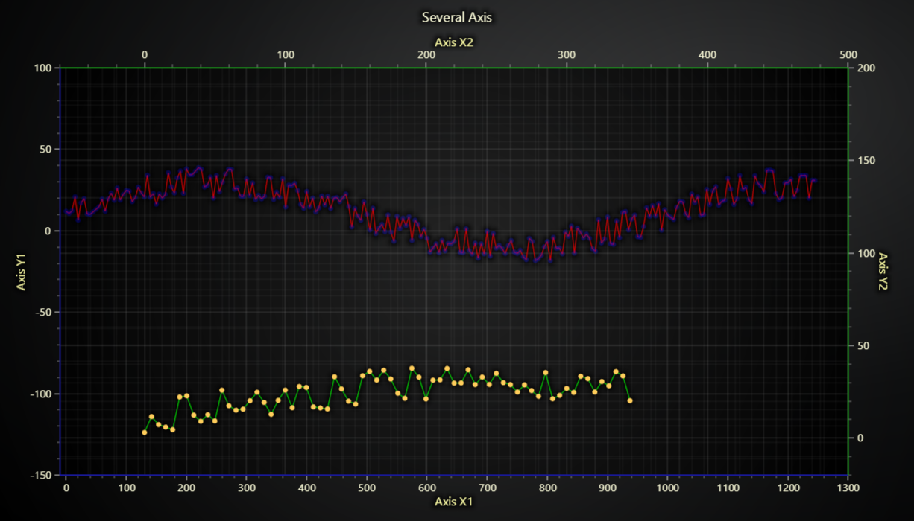

# Several AxesXY



This demo application belongs to the set of examples for LightningChart JS, data visualization library for JavaScript.

LightningChart JS is entirely GPU accelerated and performance optimized charting library for presenting massive amounts of data. It offers an easy way of creating sophisticated and interactive charts and adding them to your website or web application.

The demo can be used as an example or a seed project. Local execution requires the following steps:

-   Make sure that relevant version of [Node.js](https://nodejs.org/en/download/) is installed
-   Open the project folder in a terminal:

          npm install              # fetches dependencies
          npm start                # builds an application and starts the development server

-   The application is available at _http://localhost:8080_ in your browser, webpack-dev-server provides hot reload functionality.


## Description

_Several Axes XY chart_

This example shows creation of a Chart with 2 XY Axes. This Chart can be used to compare or see several graphs

Here's the creation of a 2 XY Axes Chart.

```javascript
// Create Chart.
const chart = lightningChart().ChartXY()
// Get references to default axes X and Y
const axisX1 = chart.getDefaultAxisX()
const axisX1 = chart.getDefaultAxisY()
// Create extra axes X and Y
const axisX2 = chart.addAxisX({
    opposite: true,
})
const axisX2 = chart.addAxisY({
    opposite: true,
})
// Create series with explicit axes.
const splineSeries1 = chart.addSplineSeries({
    xAxis: axisX1,
    yAxis: axisY1,
})
const splineSeries2 = chart.addSplineSeries({
    xAxis: axisX2,
    yAxis: axisY2,
})
// Set values of sub-categories on categories (relative Y size).
splineSeries1.add({ x: 0, y: 0.4 })
splineSeries2.add({ x: 2, y: 0.6 })
```


## API Links

* [XY cartesian chart]
* [Rectangle series]
* [Axis]
* [Solid FillStyle]
* [Solid LineStyle]
* [RGBA color factory]


## Support

If you notice an error in the example code, please open an issue on [GitHub][0] repository of the entire example.

Official [API documentation][1] can be found on [LightningChart][2] website.

If the docs and other materials do not solve your problem as well as implementation help is needed, ask on [StackOverflow][3] (tagged lightningchart).

If you think you found a bug in the LightningChart JavaScript library, please contact sales@lightningchart.com.

Direct developer email support can be purchased through a [Support Plan][4] or by contacting sales@lightningchart.com.

[0]: https://github.com/Arction/
[1]: https://lightningchart.com/lightningchart-js-api-documentation/
[2]: https://lightningchart.com
[3]: https://stackoverflow.com/questions/tagged/lightningchart
[4]: https://lightningchart.com/support-services/

© LightningChart Ltd 2009-2022. All rights reserved.


[XY cartesian chart]: https://lightningchart.com/js-charts/api-documentation/v5.2.0/classes/ChartXY.html
[Rectangle series]: https://lightningchart.com/js-charts/api-documentation/v5.2.0/classes/RectangleSeries.html
[Axis]: https://lightningchart.com/js-charts/api-documentation/v5.2.0/classes/Axis.html
[Solid FillStyle]: https://lightningchart.com/js-charts/api-documentation/v5.2.0/classes/SolidFill.html
[Solid LineStyle]: https://lightningchart.com/js-charts/api-documentation/v5.2.0/classes/SolidLine.html
[RGBA color factory]: https://lightningchart.com/js-charts/api-documentation/v5.2.0/functions/ColorRGBA.html

